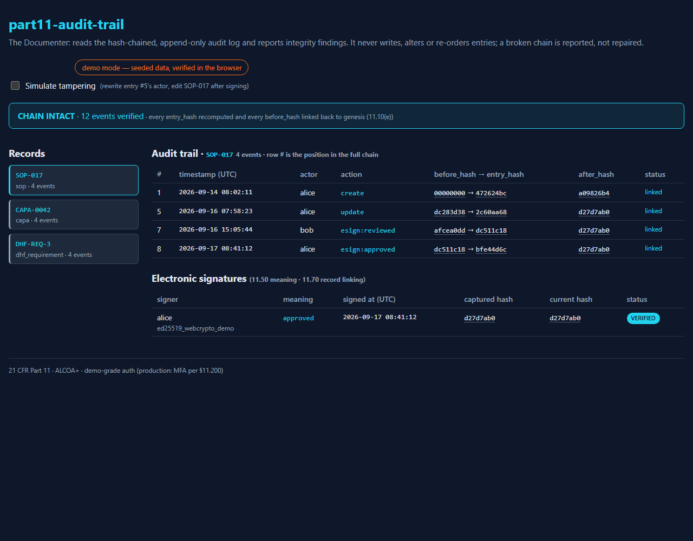
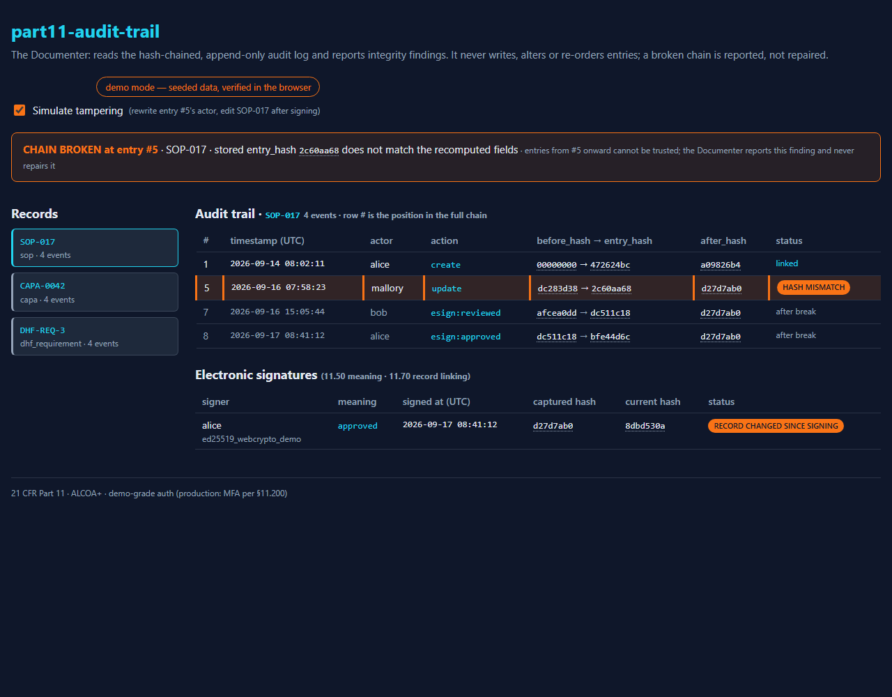
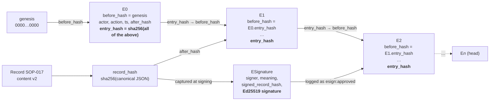

# part11-audit-trail

[](https://github.com/LSaiko/part11-audit-trail/actions/workflows/ci.yml)
[](https://github.com/LSaiko/part11-audit-trail/actions/workflows/pages.yml)
[](LICENSE)
[](https://lsaiko.github.io/part11-audit-trail/)
[](pyproject.toml)
[](.github/workflows/ci.yml)
[](https://www.ecfr.gov/current/title-21/chapter-I/subchapter-A/part-11)
[](#alcoa-to-design-decisions)

**A 21 CFR Part 11 audit trail that can prove it has not been edited, plus an electronic
signature that can prove which version of a record it was applied to.**

When an FDA investigator asks a medical device or pharma company "show me the audit trail for
this record", the honest answer from most homegrown QMS software is a database table that any
administrator could have quietly rewritten. Part 11 asks for more: 11.10(e) requires a
"secure, computer-generated, time-stamped audit trail" that records changes without obscuring
earlier values, and 11.70 requires that a signature stay linked to the record it signed. This
project implements both as *structural* properties rather than policies. Every audit entry
carries a fingerprint of the entry before it, so changing, removing or re-ordering any past
entry breaks the chain at that exact position, and the storage layer refuses `UPDATE` and
`DELETE` outright. Every e-signature is applied over the record's fingerprint at signing
time, so a later edit shows up as "record changed since signing" without invalidating the
signature itself. The write path is a FastAPI service; the viewer is a React/TS dashboard that
verifies the chain in the browser with a hash implementation proven equivalent to the server's.

<table><tr>
<td width="50%"><a href="https://lsaiko.github.io/part11-audit-trail/"></a><br><sub>Intact chain (<a href="https://lsaiko.github.io/part11-audit-trail/">live demo</a>)</sub></td>
<td width="50%"><a href="https://lsaiko.github.io/part11-audit-trail/?tamper=1"></a><br><sub>After one field is rewritten (<a href="https://lsaiko.github.io/part11-audit-trail/?tamper=1"><code>?tamper=1</code></a>)</sub></td>
</tr></table>

_The demo runs on a seeded event stream with no backend; the browser recomputes every hash, so
the broken state is detected, not painted on._

## Contents

- [Core use case](#core-use-case)
- [ALCOA+ to design decisions](#alcoa-to-design-decisions)
- [Architecture: the hash chain](#architecture-the-hash-chain)
- [How the chain proves tampering](#how-the-chain-proves-tampering)
- [21 CFR Part 11 clause map](#21-cfr-part-11-clause-map)
- [Known limitations](#known-limitations)
- [Interview talking points](#interview-talking-points)
- [Quick start](#quick-start)
- [API](#api)
- [Layout and dev commands](#layout-and-dev-commands)
- [Related projects](#related-projects)
- [Interview Q&A](#interview-qa)
- [License](#license)

## Core use case

A quality engineer edits SOP-017, a reviewer signs it as *reviewed*, an approver signs it as
*approved*. A month later someone with database access "fixes a typo" in the approved
version. In a plain log table nothing happens: the row is updated, the signatures still point
at SOP-017, and the trail looks clean. Here, the edit either goes through the service and is
logged as a new entry (the approver's signature now reports `record_hash_matches: false`,
so re-approval is visibly required), or it is attempted directly on the file and is refused
by the storage trigger, or it is done on a copy of the file and the verifier reports
`CHAIN BROKEN at entry #k` with the row highlighted. There is no fourth path where the change
is invisible.

Other services (a CAPA tracker, a document-control tool) `POST /events` to this service so
their own audit entries join the same chain; the `X-Audit-Token` header keeps that ingest
internal.

## ALCOA+ to design decisions

Each data-integrity principle maps to one concrete, tested decision rather than a procedure.

| Principle | Decision | Where |
| --- | --- | --- |
| **Attributable** | `actor` is required on every entry; a failed signature attempt is logged as `esign:auth_failed` with the attempted username (never the password) | `schemas/models.py` `AuditEventIn`, `app/signatures.py` |
| **Legible** | Entries are plain JSON with explicit field names; hashes are lowercase hex; signature `meaning` is a closed vocabulary (`reviewed`, `approved`, `authored`, `rejected`) | `schemas/models.py` `SignatureMeaning` |
| **Contemporaneous** | Timestamps are server-generated UTC only; a client-supplied `timestamp` is rejected with HTTP 422 | `schemas/models.py` `AuditEventIn` (`extra="forbid"`), `app/log_service.py` |
| **Original** | The `after_hash` of the record content is captured in the entry at write time, so the trail holds a fingerprint of every version ever written | `app/records.py`, `crypto/hashing.py` `record_hash` |
| **Accurate** | Content is canonicalised (sorted keys, no whitespace) before hashing, so the same record always produces the same fingerprint regardless of key order | `crypto/hashing.py` `canonical_json` |
| **Complete** | `entry_hash` covers *every* field including `record_type` and `after_hash`, and fields are joined with a control character so no two field layouts can collide | `crypto/hashing.py` `entry_hash` (`DELIMITER = "\x1f"`) |
| **Consistent** | Entries are ordered by SQLite `rowid`; each `before_hash` must equal the previous `entry_hash`, so re-ordering is a chain break | `app/verifier.py` |
| **Enduring** | SQLite `BEFORE UPDATE` / `BEFORE DELETE` triggers `RAISE(ABORT)`; the `AuditLog` class exposes no modify or delete method (a test asserts its public surface) | `app/log_service.py` `_DDL`, `tests/test_chain.py` |
| **Available** | `GET /events` returns the full chain; `GET /audit-trail/{id}` returns one record's entries plus the integrity result of the whole chain; the verifier works on a read-only copy of the file | `app/main.py`, `tests/test_chain.py::test_persisted_file_can_be_verified_read_only` |

## Architecture: the hash chain



- `crypto/` holds the two primitives and nothing else: `hashlib.sha256` for the chain and
  record fingerprints, `cryptography`'s Ed25519 for signatures. It never imports the app.
- `app/log_service.py` is the only writer. A lock serialises "read the current head, insert
  the next entry", so concurrent writers cannot both chain to the same predecessor.
- `app/verifier.py` walks the chain from genesis and stops at the first entry whose
  `before_hash` does not match its predecessor or whose `entry_hash` does not recompute.
- `dashboard/src/verify.ts` is a line-for-line mirror of the Python hashing; a build-time
  script asserts both produce identical digests for a shared fixture, so the Pages demo is
  verified by code proven equivalent to the server's.

## How the chain proves tampering

A hash is a fingerprint: a fixed-length code computed from some data, where changing even one
character of the data produces a completely different code, and there is no practical way to
find different data that yields the same code.

Every entry in this log stores two fingerprints. `entry_hash` is the fingerprint of the entry
itself (who, what, when, which record, what the record looked like afterwards). `before_hash`
is a copy of the previous entry's fingerprint. So entry 6 contains entry 5's fingerprint,
entry 5 contains entry 4's, and so on back to a fixed starting value for the first entry.

Now suppose someone changes the actor on entry 5 from "alice" to "mallory". Entry 5's stored
fingerprint was computed from "alice", so it no longer matches what the entry now says. The
verifier, walking from the start, recomputes entry 5's fingerprint, sees the mismatch, and
reports `CHAIN BROKEN at entry #5`. Could the attacker recompute and overwrite entry 5's
fingerprint too? Yes, but entry 6 still holds a copy of the *old* one, so the break moves to
entry 6. To hide the change they would have to rewrite every fingerprint from entry 5 to the
end of the log, which is exactly the kind of wholesale rewrite that a reviewer comparing
against any earlier export, backup or signature will catch. Deleting entry 5 leaves entry 6
pointing at a fingerprint that no longer exists; swapping entries 5 and 6 leaves each pointing
at the wrong predecessor. In every case the verifier names the first position that fails.

Contrast a plain log table. An administrator runs `UPDATE audit_log SET actor='mallory' WHERE
id=5`, the database says "1 row updated", and nothing else in the system knows. The log
*records* changes made through the application, but it cannot show that it has not itself
been changed. That is the difference between tamper-*logging* and tamper-*evidence*.

Two more layers sit around the chain. The storage triggers mean the `UPDATE` above is refused
on the live file, so an attacker has to work on a copy, which then fails verification. And a
signature is applied to the record's fingerprint at signing time, so a record edited after
approval shows `record changed since signing` while the signature itself remains authentic:
you can still prove what the approver actually approved.

## 21 CFR Part 11 clause map

| Clause | Requirement | Here | Grade |
| --- | --- | --- | --- |
| 11.10(c) | Protection of records for accurate, ready retrieval through the retention period | Append-only SQLite with refusing triggers; full chain retrievable via `GET /events` | Demo (single file, no backup/retention policy) |
| 11.10(e) | Secure, computer-generated, time-stamped audit trail; changes do not obscure prior values | Hash-chained entries with server timestamps; every version's `after_hash` is retained; verifier pinpoints breaks | Production-shaped (tail truncation excepted, see limitations) |
| 11.50 | Signed records show the signer's name, date/time and meaning | `ESignature` carries `signer`, `timestamp`, closed-vocabulary `meaning`; all three are inside the signed bytes | Production-shaped |
| 11.70 | Signatures linked to their records so they cannot be excised, copied or transferred | Signature covers `signed_record_id` + `signed_record_hash`; re-pointing it at another record or signer fails Ed25519 verification (tested) | Production-shaped |
| 11.100 / 11.200(a) | Unique signatures; at least two identification components | Username + password checked with scrypt and constant-time compare; failed attempts logged | Demo (single factor, no MFA, no lockout; see `app/auth.py`) |
| 11.300 | Controls for identification codes and passwords | Not implemented; credentials come from an env var | Demo |

## Known limitations

- **Tail truncation.** Dropping the newest N entries (for example restoring an older copy of
  the file) leaves a shorter chain that still verifies. Fix: periodically sign the head hash
  plus the row count with the server key and store that checkpoint out-of-band; the verifier
  then compares the current head against the last checkpoint. Marked `# ponytail:` in
  `app/log_service.py`.
- **Single server key.** One Ed25519 key signs on behalf of every authenticated signer, so a
  signature proves "this server, after authenticating alice, attested to this hash", and
  non-repudiation rests on trusting the server. Fix: per-signer keys in an HSM/KMS with the
  server key only countersigning.
- **Demo authentication.** Username/password from `AUDIT_DEMO_USERS`; no MFA, lockout or
  credential ageing. Fix: an identity provider with MFA and the 11.300 controls.
- **In-memory records and signatures.** Only the audit log is on disk; records and signatures
  are process-lifetime dicts. Fix: a second append-only table with the same triggers.

## Interview talking points

- **Audit trails are the weakest link in homegrown QMS software** because they are usually an
  afterthought: a `history` table written by application code, readable and writable by the
  same database user as everything else. Every FDA 483 that cites "audit trail functionality
  was not enabled" or "records could be modified without a trace" is this pattern. The fix is
  not more logging; it is making the log unable to lie about itself.
- **Hash chaining versus "having a log table".** A log table records changes; a hash chain
  additionally records *that the log has not changed*. The cost is about ten lines of code
  (one `sha256` call per entry, one loop in the verifier) and one design constraint: a single
  serialised writer.
- **Storage-layer enforcement beats application-layer discipline.** The `BEFORE UPDATE` and
  `BEFORE DELETE` triggers refuse rewrites even from raw SQL, so "no delete method in the
  service class" is a test, not a promise.
- **Signatures over hashes, not over rows.** Signing the record's fingerprint at signing time
  means the signature stays verifiable forever and the system can say precisely whether the
  record is still the version that was signed. Signing the row id would say nothing about
  content; signing the content itself would make every verification re-read the full record.
- **The verifier in the browser is the same verifier.** Equivalence is asserted at build time
  from a shared fixture, so the Pages demo is not a mock-up of integrity checking.

## Quick start

```
python -m venv .venv && .venv/Scripts/pip install -e .[dev]
.venv/Scripts/python -m pytest --cov=app --cov=schemas --cov=crypto --cov-branch --cov-fail-under=100
.venv/Scripts/python -m uvicorn app.main:app --port 8011      # AUDIT_DB_PATH=audit.db to persist
cd dashboard && npm install && npm run dev                     # live mode against :8011
```

```
# create, sign, edit, verify
curl -X PUT localhost:8011/records/sop/SOP-017 -H 'content-type: application/json' \
     -d '{"actor":"alice","content":{"title":"Cleaning SOP","revision":3}}'
curl -X POST localhost:8011/sign -H 'content-type: application/json' \
     -d '{"username":"alice","password":"alice-pw","record_id":"SOP-017","meaning":"approved"}'
curl -X PUT localhost:8011/records/sop/SOP-017 -H 'content-type: application/json' \
     -d '{"actor":"bob","content":{"title":"Cleaning SOP","revision":4}}'
curl localhost:8011/verify-signature/<signature id>   # record_hash_matches: false
curl localhost:8011/verify-chain                      # chain_valid: true (the edit was logged, not hidden)
```

Environment (all via `os.getenv`, none hardcoded): `AUDIT_DB_PATH` (default in-memory),
`AUDIT_SIGNING_KEY` (base64 32-byte seed; ephemeral key plus a warning when unset),
`AUDIT_DEMO_USERS` (`user:pw,...`, default `alice:alice-pw,bob:bob-pw`),
`AUDIT_INTERNAL_TOKEN` (guards `POST /events`; open plus a warning when unset).

## API

| Method | Path | Purpose |
| --- | --- | --- |
| `POST` | `/events` | Internal ingest (`X-Audit-Token`); client cannot supply `id`, `timestamp` or hashes (422) |
| `GET` | `/events` | Full chain in append order |
| `PUT` | `/records/{type}/{id}` | Create / replace a record; logged with its content hash |
| `GET` | `/audit-trail/{id}` | One record's events plus integrity of the **whole** chain |
| `POST` | `/sign` | Authenticate, capture record hash, Ed25519-sign, log `esign:<meaning>` |
| `GET` | `/signatures` | All captured signatures |
| `GET` | `/verify-chain` | `IntegrityCheckResult` over every event |
| `GET` | `/verify-signature/{id}` | Ed25519 check plus captured-vs-current record hash |

## Layout and dev commands

- `/app` FastAPI backend: `log_service.py` (only writer), `verifier.py`, `auth.py`,
  `records.py`, `signatures.py`, `main.py`
- `/crypto` `hashing.py` (sha256 chain + record fingerprints), `signing.py` (Ed25519); isolated
- `/schemas` Pydantic v2 models
- `/dashboard` React/TS viewer (Vite); `src/verify.ts` mirrors the Python verifier;
  `scripts/check-seed.mjs` is the build-time parity proof (Node >= 22.18)
- `/tests` pytest, 94 tests, 100% line and branch coverage enforced in CI
- `/docs` `architecture.md`, screenshots
- `ruff check .` / `mypy app schemas crypto` / `pytest` / `cd dashboard && npm run build`
- Pages build: `VITE_BASE=/part11-audit-trail/ npm run build` (`MSYS_NO_PATHCONV=1` on Git Bash)

## Related projects

- [sop-review-tool](https://github.com/LSaiko/sop-review-tool): 21 CFR 820 SOP compliance
  reviewer. Consumer of this signature workflow: a reviewed SOP is the electronic record an
  approver signs with `meaning: approved`, and the review's own audit entries do
  `POST /events` into this chain when `PART11_AUDIT_URL` is set
  ([Part 11 integration](https://github.com/LSaiko/sop-review-tool#part-11-integration)).
- [capa-tracker](https://github.com/LSaiko/capa-tracker)
  ([live demo](https://lsaiko.github.io/capa-tracker/)): the Explainer. Its
  `ClosureRecord.closed_by` is the documented Part 11 hook point; the signature would be
  captured over the `ClosureEvidence` hash exactly as `POST /sign` captures a record hash
  here, and each CAPA state transition would `POST /events`.
- [traceability-matrix-dhf](https://github.com/LSaiko/traceability-matrix-dhf)
  ([live demo](https://lsaiko.github.io/traceability-matrix-dhf/)): the Archivist. Consumer of
  audit records as design-history-file evidence: a verified chain segment for a requirement's
  record is the evidence that its history is complete.
- [ml-samd-validator](https://github.com/LSaiko/ml-samd-validator)
  ([live demo](https://lsaiko.github.io/ml-samd-validator/)): the Inspector, sibling role to
  this repo's Documenter; its locked `ModelBaseline` and validation evidence are the kind of
  records whose approval this trail would carry.

## Interview Q&A

**Why hash chaining rather than a simple append-only log table?** An append-only table
protects the *live* file against the application and against anyone who respects the
triggers. It does nothing for a copy of the file, a restored backup, or a DBA who drops the
trigger first. The chain is a property of the *data*, not of the container: any copy, on any
machine, can be verified from genesis by anyone with the verifier, and the first altered,
removed or re-ordered entry is named by position. The two together mean the live file resists
rewriting and every other copy exposes it.

**Demo-grade auth versus production MFA: what is the trade-off?** 11.200(a)(1) requires at
least two distinct identification components for a non-biometric signature; this repo has one
(username + password, scrypt-hashed, constant-time compared). Adding a second factor here would
mean either a fake one-time code that proves nothing or a real identity provider that makes
the demo undeployable on Pages. The `# ponytail:` comment in `app/auth.py` names the ceiling
and the upgrade (OIDC with MFA, 11.300 lockout and ageing); the signature service already
takes a `users` mapping so the identity source is swappable without touching the signing path.

**What does hash chaining not protect against, and what fixes it?** Two things. Tail
truncation: dropping the newest entries leaves a shorter chain that still verifies, because
nothing after the new head vouches for what was removed. The fix is a periodically signed
checkpoint of the head hash and row count stored out-of-band, so "the chain is shorter than
the last checkpoint" becomes a finding. Server-key trust: one Ed25519 key signs for every user,
so a compromised server can mint signatures. The fix is per-signer keys held in an HSM/KMS,
with the server key countersigning. Both are tested as documented limitations rather than
hidden.

**How does a signature stay verifiable after the record changes, and why is that desired?**
The signature covers the record's *fingerprint at signing time*, not the record's current
state. After an edit, `verify` reports two independent facts: `signature_valid: true` (alice
really did sign this fingerprint with this meaning) and `record_hash_matches: false` (the
record is no longer that version). That split is what 11.70 wants: you can still prove what
was approved and by whom, while making it impossible to present the edited version as the
approved one. If the edit invalidated the signature instead, the evidence of the original
approval would be lost at exactly the moment it matters.

## License

MIT, see [LICENSE](LICENSE).
